# Исследование современного состояния проблемы

## Oценкa современного состояния и перспективных направлений в области лингвистических моделей, применяемых в медицинских и диагностических экспертных системах

## Моделирование экспресс-анализатора на антигены семейства коронавирусов

Для моделирования экспреесс анализатора расмотрим виды и способы индикации
инфицирования человека. В качестве средств индикации инфицирования человека
коронавирусом могут выступать прямые методы, например полимеразной цепной
реакции, на наличие РНК SARS-CoV-2 , выращивание культуры и косвенные
методы - на наличие антител в организме, которые можно разделить на твердо- и
жидкофазные. К твердофазному методу можно отнести иммунохроматографический
метод. К жидкофазному методу относится метод, использующей жидкофазную
иммуноферментную среду  (ИФА), основанный  на определении антител
выработанных на внедрение чужеродного антигена. Под антигенами понимаются
белки иммуноглобулина, вырабатываемые иммунной системой. На практике для
мониторинга наличия антител используется равновесная константа диссоциация
Kd (моль/л), показывающая отношение  равновесных концентраций свободного
антигена и свободного антитела к комплексу антиген-антитело.

Для построения прибора экспресс-диагностики заболевания и инфицирования
семейства коронавирусов CoV необходимо определить так же  симптомы
заболевания с последовательным уточнением диагноза. Первичными симптомами
заболевания обычно выступают повышенная температура, раздражение дыхательных
путей, после чего необходим  последующий диагноз заболевания. Возбудитель
передается аэрозольным, фекально-оральным и контактным путем. Как правило,
коронавирусы вызывают поражение дыхательных путей и желудочно-кишечного
тракта. Инкубационный период в среднем продолжается 2-7 суток, в ряде случаев
достигает 10 суток. Обобщенная клиническая последовательность внешнего
проявления коронавируса составляет несколько этапов.

Упрощенная схема проектируемого прибора будет включать 4 основных модуля:
модуль М1 - забор биоматериала, модуль М2 - выделение иммуноглобулинов,
модуль М3 - ввод моноклональных антител, модуль М4 - анализ равновесной
константы  диссоциации Kd комплекса  иммуноглобулинов IgM, IgG, S0-S3 -
состояния исследуемого пациента. На первом этапе производится забор проб. На
следующем этапе определяется антиген коронавируса (XH), характерный для
данного вида животного или человека и происходит управление барабаном с
установленными экспресс тестами. Результаты диагностики могут показать
положительную или отрицательную реакцию, а также быть неточными или
недействительными, исходя из показаний детекторных сигналов. В качестве
индикатора CoV-антител предлагается использовать  набор диагностических
щупов. Щуп представляет собой нитроцеллюлозную мембрану, содержащую
моноклональные антитела, выдающие тестовый "Т" и контрольный сигналы "С".
Подвижные CoV-антитела связываются с частицами коллоидного золота,
нанесенными на подушку конъюгата, а на зону индикатора "Т" наносятся
вторичные иммобилизованные антитела. При попадании достаточного количества
антигенов коронавируса в зону антител образуется комплекс антиген-антитело
(mAb/cG), мигрирующий вдоль тестовой мембраны.При попадании достаточного
количества антигенов коронавируса в зону антител образуется комплекс
антиген-антитело (mAb/cG), мигрирующий вдоль тестовой мембраны. Дойдя до
линии "Т", комплекс mAb/cG захватывается вторичными иммобилизованными
антителами с активацией сигнала  "Т". Для контроля достоверности анализа
используется сигнал "С". Тестирование на обнаружение антигенов коронавируса
проводится через 5 минут. Результат анализа может принять четыре состояния:
отрицательное (Zn), положительное (Zp), сомнительное (Zd) и недействительное
(Znv).

Симуляция работы системы экспресс-анализа необходима для проверки правильности
работы модулей прибора. Для построения модели прибора экспресс-анализатора
выбран PLC Omron, хорошо зарекомендовавший себя в медицинской и ветеринарной
сфере использования. Разработка релейно-контактной схемы (LD) прибора
проведена с использованием CX-Programmer. Разработка сенсорного монитора
лаборанта оператора экспресс-анализа выполнена с помощью модуля CX-Designer
(рисунок). Симуляция программы экспресс-анализа показала правильную логику
работы тест системы и индикации сигналов на проектируемой панели прибора.

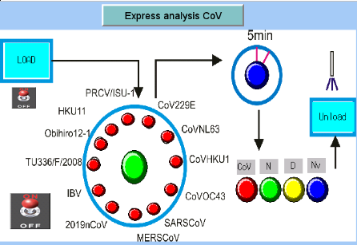 

Для ускорения постановки диагноза заболевания и повышения безопасности работы
медицинских и ветеринарных работников предложена разработка проекта
устройства экспресс-анализа по установлению состояния инфицирования
коронавирусом. Изучена методика экспресс анализа инфицирования семейством
коронавирусов с помощью специальных диагностических щупов на основе
использования вторичных иммобилизованных антител. Построение прибора экспресс
диагностики инфицирования коронавирусом позволит решить проблему
безопасности, оперативности и уменьшить эпидемиологическую ситуацию,
связанную с распространением коронавируса в мире.

# Разработка технических заданий

## Подготовка частного технического задания на механическую часть экспресс-анализатора на антигены семейства коронавирусов

## Составление технического задания на создание прототипа демонстратора технологии

1) Общие положения

1.1) Полное наименование системы и ее условное обозначение

1.1.1) "Моделирование и разработка прототипа программно-аппаратного комплекса  экспресс-анализатора на антигены семейства коронавирусов"

2) Назначения и цели создания системы
2.1.)  Назначение

Система предназначена для обработки результатов проведения анализа .

2.2.) Цели и задачи создания системы

Система создаётся с целью получения инструмента для процесса выявления антител класса IgG/IgM к SARS-CoV-2 и антигена коронавируса SARS-CoV-2.

В результате создания Системы должны быть решены следующие задачи:

3.) Характеристика объекта автоматизации

3.1 )Объектом автоматизации является процесс получения результата экспресс-теста для выявления антител и антигена к SARS-CoV-2.

Этапы процесса автоматизации:
1. Забор биоматериала у пациента;
2. Загрузка биоматериала в Систему;
3. Процедура анализа Системой;
4. Выдача результата оператору Системы.

3.2) Характеристика системы в целом

Набор реагентов «Экспресс-тест для выявления антигена коронавируса SARS-CoV-2
методом иммунохроматографическога анализа «Экспресс-антиген SARS-CoV-2-ИХА»
для диагностики in vitro», по ТУ 21.20.23-004-23327034-2020, серия LSPZ20K01,
Комплект №1, код ОКПД2: 21.20.23.110.

3.3) Характеристика к структуре и функционированию системы

(Экспресс-антиген SARS-CoV-2-HXA) представляет собой качественный
иммунохроматографический анализ для выявления антигена коронавируса SARS-CoV-
2 в образце (мазок из носоглотки человека). Принцип работы теста основан на
иммунохимическом методе определения антигена иммуноглобулинами. Образец
абсорбируется материалом полоски и содержащийся в нем антиген реагируют с
окрашенными микрочастицами, покрытыми специфическим антителом. Под действием
капиллярных сил данный комплекс перемещается в тестовую зону (Т) и реагирует с
вторыми антителами, специфичными к антигену коронавируса SARS-CoV-2, в
результате чего появляется видимое окрашивание тестовой полосы (Т). Если антиген
коронавируса SARS-CoV-2 отсутствует в образцах, то тестовая пиния не проявляется.
Контрольная линия (С) используется для процедурного контроля и должна всегда
отображаться, если процедура тестирования выполнена правильно.

3.4) Характеристика к режимам функционирования системы

1 Извлечь тест-картридж из упаковки и поместить на сухую ровную горизонтальную
поверхность отверстиями вверх. Вскрытый картридж использовать в течение 3 часов.
Хранению не подлежит.
2 Внести 5 капель (250 мил) буферного раствора из флакона-капельницы в
микроцентрифужную пробирку.
3 Провести процедуру взятия мазка со слизистой оболочки носоглотки.
4 Погрузить велюр-тампон (не входящий в комплект) с полученным образцом в
микроцентрифужную пробирку с буферным раствором и вращательными движениями
(от 10 до 20 раз) перемешать образец с жидкостью, добиваясь полного переноса
материала в буферный раствор.
5 Удалить назофарингеальный велюр-тампон из пробирки, осторожно прижимая
голову тампона к стенкам пластиковой пробирки. Утилизировать велюр-тампон с
соблюдением всех мер биологической безопасности.
6 Аккуратно внести все содержимое пластиковой пробирки в окно для образца тест-
картриджа.
7 Запустить таймер.
8 Оценить результат реакции визуально через 8-15 минут. В течение этого периода
времени тест-картридж должен находиться в покое - его не следует передвигать,
переворачивать и т.д.

Интерпретация Отрицательного результата:
В контрольной зоне (С» проявляется окрашенная полоса, а тестовой зоне «Т»
окрашивания не происходит.
Отрицательный результат анализа указывает на отсутствие антигена коронавируса
SARS-CoV-2 в исследуемом образце в пределах чувствительности теста.
Отрицательный результат теста «Экспресс-антиген SARS-CoV-2-ИХА» не исключает
возможности инфицирования вирусом SARS-CoV-2. Если результат теста
отрицательный, а клинические симптомы сохраняются, необходимо провести
дополнительное повторное тестирование, а также дополнительное тестирование с
использованием других лабораторных и/или инструментальных методов.
Интерпретация Положительного результата:
Появляются две окрашенные полосы. Одна полоса обязательно должна находиться в
контрольной зоне «С», другая в зоне «Т».
Опрашивание в тестовой зоне «Т» - свидетельствует о наличии антигена коронавируса
SARS-CoV-2 в исследуемом образце.
Интерпретация Недействительного результата:
В контрольной зоне «С» не появляется окрашенной полосы независимо от наличия
полосы в тестовой зоне «Т».
Недостаточный объем пробы или неправильная процедура выполнения теста.
Пересмотрите процедуру выполнения и повторите тестирование, используя новый тест.
Если проблема сохраняется, немедленно прекратите использование тестового набора и
обратитесь к дистрибьютору.

3.5) Характеристика по диагностированию системы

Внутрений контроль включен в тест. Цветная линия, появляющаяся в контрольной зоне, является внутренним контролем. Это подтверждает достаточный объем пробы и правильность процедуры выполнения.

3.6) Характеристика к безопасности

Все образцы, полученные для лабораторного исследования, следует считать
потенциально инфицированными, и при работе с ними должны учитываться
требования СП 1.3.3118-13 «Безопасность работы с микроорганизмами I – II групп
патогенности (опасности)». Медицинские работники, которые собирают или
транспортируют клинические образцы в лабораторию, должны быть обучены практике
безопасного обращения с биоматериалом, строго соблюдать меры предосторожности и
использовать средства индивидуальной защиты (СИЗ).

3.7) Характеристика к эксплуатации, техническому обслуживанию, ремонту и хранению компонентов системы

Не допускается замораживание экспресс-теста. Хранение в упаковке предприятия-изготовителя экспресс-теста при температуре от +2 до +30 градусов по Цельсию, согласно сроку годности компонентов. Хранение вскрытого экспресс-теста при температуре от +18 до +25 градусов по Цельсию,не более 3 часов. Транспортирование медицинского изделия - при температуре от +2 до +30 градусов по Цельсию, транспортом всех видов в крытых транспортных средствах в соответствии с правилами перевозок, действующими на транспорте данного вида. Изделие не подлежит техническому обслуживанию и ремонту.

4.) Требования к системе

4.1.) Требования к системе в целом

4.1.1.) Требования к структуре и функционированию системы

4.1.1.1) Требования к способам и средствам связи для информационного обмена между компонентами системы

Подсистемы в процессе функционирования должны осуществлять обмен информацией на основе открытых форматов обмена данными, используя для этого входящие в их состав модули информационного взаимодействия.

4.1.1.2) Требования к характеристикам взаимосвязей создаваемой системы со смежными системами

Система должна осуществлять обмен информацией со смежными системами по локальной сети. В рабочем состоянии Система должна иметь доступ к сети интернет.

4.1.1.3) Требования к режимам функционирования системы

Предусмотрено использование Системы в следующих режимах:
1. режим первоначального заполнения данными;
2. основной режим;
3. аварийный режим;

4.1.1.4) Требования по диагностированию системы

Диагностика и профилактика технических средств, проводится провайдером информационных услуг по мере необходимости.

4.1.1.5) Перспективы развития, модернизации системы

Система должна иметь возможность дальнейшей модернизации программного обеспечения.

4.1.2) Требования к безопасности

Требования не предъявляются.

4.1.3) Требования к эргономике и технической эстетике

Система должна обеспечивать доступ к .

4.1.4) Требования к эксплуатации, техническому обслуживанию, ремонту и хранению компонентов системы

Требования не предъявляются.

4.1.5) Требования к сохранности информации при авариях

Программное обеспечение Системы должно восстанавливать свое функционирование при корректном перезапуске аппаратных средств.

4.1.6) Требования к защите от влияния внешних воздействий

Оборудование и ПО должны быть защищены от внешних воздействий в полном соответствии с требованиями по эксплуатации.

4.1.7) Требования к патентной чистоте

Требования не предъявляются.

4.2.1) Требования к математическому обеспечению

Математическое обеспечение должно обеспечивать в системе реализацию перечисленных в ТЗ функций и требований. Используемые алгоритмы должны соответствовать требованиям быстродействия и безопасности фреймворка Django / Flask.

4.2.2) Требования к лингвистическому обеспечению

Все программное обеспечение Системы для организации взаимодействия с пользователем использует русский язык, а также иметь возможность работы со всеми языками, утверждёнными в перечне стран-носителей.

4.2.3) Требования к программному обеспечению системы

При проектировании, разработке и эксплуатации Системы следует использовать следующее программное обеспечение:
1. язык программирования Python 3;
2. фреймворк на языке программирования Python для разработки веб-приложений
3. Django;
4. СУБД MongoDB.

4.2.4) Требования к техническому обеспечению

Требования не предъявляются.

4.2.5) Требования к организационному обеспечению

Требования не предъявляются.

4.2.6) Требования к методическому обеспечению

Требования не предъявляются.

## Создание частного технического задания на программную часть прототипа демонстратора технологии

## Составление технического задания на разработку системы технического зрения экспресс-анализатора.     

# Приобретение оборудования

В качестве микроконтроллера для управления мехатроникой
прототипа-демонстратора технологии экспресс-анализатора антигенов
коронавируса была приобретена плата Arduino Mega 2560 по цене 6030,0 рублей.
Микрокомпьютер Raspberry Pi 4 Model B 8GB по цене 24000,0 рублей был
приобретен в качестве микрокомпьютера для решения задач компьютерного зрения
прототипа-демонстратора технологии экспресс-анализатора антигенов
коронавируса. Карта памяти Transcend 128GB microSD была приобретена за 5918,0
рублей в качестве дискового накопителя для микрокомпьютера, используемого для
хранения и работы операционной системы и системных программ.

Камера A4Tech Web A4Tech по цене 4950,0 рублей приобретена в качестве
видеокамеры для решения задач технического зрения прототипа-демонстратора
технологии экспресс-анализатора антигенов коронавирусов. USB-разветвитель
приобретен по цене 550,0 рублей в качестве разветвителя последовательного
интерфейса для подключения периферийных устройств. Для хранения данных
прототипа-демонстратора технологии экспресс-анализатора коронавирусных
антигенов приобретен жесткий диск SATA объемом 120 Гб 2,5" по цене 1860,0
рублей. Приобретен внешний 2,5" бокс для хранения данных (поз. 6) для
подключения к микрокомпьютеру (поз. 2) по цене 730,0 рублей. 

Вентилятор 40x40x10 мм, 12 В по цене 990,0 руб. приобретен в качестве
устройства для охлаждения корпуса прототипа-демонстратора технологии
экспресс-анализатора антигенов коронавирусов. Приобретена плата управления
для 3D-принтера 1.4 RAMPS по цене 898,0 рублей в качестве платы для
подключения драйверов управления шаговыми двигателями и других мехатронных
устройств прототипа-демонстратора технологии экспресс-анализатора антигенов
коронавирусов. Драйвер шагового двигателя A4988 с радиатором был приобретен в
качестве микросхемы управления маломощным шаговым двигателем (поз. 23) по
цене 1390,0 руб.

Для предотвращения выхода рабочего органа за границы рабочей зоны был
приобретен концевой выключатель Mechanical EndStop по цене 590,0 руб. В
качестве аналоговой микросхемы для считывания тока в цепи управления
прототипа-демонстратора технологии экспресс-анализатора антигенов
коронавируса приобретен датчик тока 5А по цене 1990,0 рублей. Для перемещения
органа управления по направляющему валу была приобретена каретка с
линейным подшипником SCS8LUU  по цене 1494,0 рублей.  Вал гладкий
(направляющий) 8мм, 600мм по цене 3030,0 руб. приобретены для создания
конструкции подвижной рабочей зоны прототипа-демонстратора технологии
экспресс-анализатора на антигены семейства коронавирусов. TR8 гайка без люфта
по цене 895.0 руб. THSL-600-8D вал винтовой с гайкой, 600мм по цене 9735.0
руб. SK8 держатель вала по цене 495.0 руб. опорный подшипник фланца KP08
(8мм.) цена 447.0 руб. муфта для переключения с оси 5мм на ось 8мм по цене
1032.0 руб. Каретка с линейным подшипником SCS8UU по цене 338.0 руб.

DC-DC понижающий преобразователь напряжения LM2596 приобретен по цене 1428,0
руб. в качестве электрического устройства для преобразования электрической
энергии в электрической цепи прототипа-демонстратора технологии
экспресс-анализатора семейства антигенов. Шаговый двигатель 17HS4401
nema17 приобретен в качестве маломощного исполнительного механизма по цене
6490,0 руб. Кронштейн-уголок для Nema 17 был приобретен в качестве опорной
конструкции для крепления исполнительного устройства малой мощности (поз. 23)
по цене 300,0 руб.

Для аддитивной печати конструктивных элементов прототипа-демонстратора
технологии экспресс-анализатора антигенов семейства коронавирусов приобретен
пластик PETG Black по цене 5750,0 рублей. Для изготовления элементов
конструкции прототипа-демонстратора технологии экспресс-анализатора антигенов
коронавирусов был приобретен конструкционный алюминиевый профиль (1 метр) по
цене 16400,0 рублей. Шаговый двигатель Nema 34, 86HS115-6004 по цене 14398,0
руб. Приобретен драйвер шагового двигателя TB6600 с радиатором по цене 6392.0
руб. в качестве микросхемы управления исполнительным устройством большой
мощности. 

Блок питания 12v 12.5A приобретен по цене 7500.0 руб. в качестве источника
питания прототипа-демонстратора технологии экспресс-анализатора антигенов
коронавируса. Сервопривод MG996R был приобретен за 3990,0 руб. в качестве
сервоустройства для перемещения рабочего органа вокруг своей оси. Моноблок
27" Acer Aspire был приобретен по цене 65000,0 руб. для использования в 
качестве терминального устройства управления экспресс-анализатором.

# Cоставление правил экспертной системы

## Подготовка текстового описания правил экспертной системы 

Текстовое описание правил экспертной системы было выполнено (предварительно)
с использоватьем механизмов извлечения знаний из текста. Для этого были взяты 
руководства к тест-системам на определение антител и антигенов и подвергнуты 
текст-майнингу.

В результате получилось следующее текстовое описание:

Понятие иммунохроматографический анализ включает такие понятия, как тип
анализа, обнаружение антигена коронавируса sars-cov-2, биологические
материалы, иммунохроматографическая экспресс-диагностика, метод определения
наличия, носоглотка человека, определенные концентрации веществ, плазма
крови, тонкослойная хроматография и цельная кровь. Элемент окрашенная полоса
включает такие понятия, как горизонтальные полосы, их может быть две или
одна. Элемент носовая полость включает такие понятия, как нижняя носовая
раковина, верхняя челюсть, слизистая оболочка, грушевидное отверстие,
дыхательная система, дыхательные пути, боковая стенка, лицевой череп, носовая
кость, носовая перегородка, нёбная кость, обонятельный анализатор,
ограниченный нос, околоносовые пазухи, перпендикулярная пластинка, воздушный
поток, решетчатая кость, слезная кость и три участка. 

Элемент острые инфекционные заболевания представляет собой инфекционные
заболевания. Обозначение элемента образец сыворотки включает такие термины,
как анализ, иммунизированные животные, образец крови. Элемент тип анализа
представляет собой набор реагентов. Элемент часть субъекта - безымянный
палец. Понятие основные симптомы представляет собой клинические симптомы.
Понятие нереактивные образцы включает такие понятия, как область носа, нижние
дыхательные пути и эталонная плазма. Понятие некоторые животные представляет
возможность инфекции. Обозначение sampling включает такие понятия, как
нереактивные образцы, образец тестового картриджа и образцы сыворотки.
Обозначение нижних дыхательных путей включает такие понятия, как верхние
дыхательные пути, дыхательные пути, дыхательная система человека, носовая
полость, органы дыхания, парные органы дыхания и носовая полость. Элемент
nasopharyngeal mucosa включает такие понятия, как nasal cavity, nasal cavity,
posterior wall of nasopharynx, posterior wall, lymphoid tissue, atrial
epithelium, and acute pharyngitis. 

Термин "сбор биоматериала" включает биологический образец, контрольную зону,
носоглоточный велюровый тампон и пластиковую пипетку. Термин биологический
образец включает такие понятия, как биологические жидкости человека,
биологические материалы человека, биологическое происхождение, лицензионные
изображения, отбор проб и продукты выделения. Термин возможность заражения
включает такие понятия, как вероятность заражения вич, вич-инфекция,
заражение ребенка, медицинские работники, наличие инфекций, обнаружение
антител, риск передачи вич и постконтактная профилактика вич-инфекции.
Элемент процедура взятия мазка включает такие понятия, как биологический
материал, тщательный туалет и цервикальный канал. 

Элемент пластиковый аппликатор представляет процедуру взятия мазка.
Обозначение реакция активной среды представляет собой качественную реакцию.
Термин контрольная область представляет собой часть объекта. Элемент
носоглотка человека включает такие понятия, как носовая полость, воспаление
носоглотки, боковые стенки, ротовая полость и слизистая оболочка. Элемент
пластиковая пипетка включает такие понятия, как быстрая доставка, жидкие
лекарства, лабораторная посуда, небольшое количество жидкости, небольшое
количество и передача жидкости. Обозначение инфекционного заболевания
включает такие понятия, как группа заболеваний, инкубационный период,
инфекционное заболевание, инфекционный процесс и коронавирусная инфекция.

Элемент коронавирусная инфекция - это новая коронавирусная инфекция.
Обозначение медицинского оборудования включает такие понятия, как
государственная регистрация, другие поставки, медицинская деятельность,
медицинские изделия, номенклатурная классификация, различные заболевания.
Обозначение домашней среды представляет собой комнатную температуру. Элемент
метода обнаружения присутствия включает такие понятия, как бактериальные
респираторные инфекции, новая коронавирусная инфекция и коронавирусная
инфекция. Элемент обнаружения антигена коронавируса sars-cov-2 представляет
новую коронавирусную инфекцию. Элемент результата реакции включает такие
понятия, как качественная реакция, реакция замещения, реакция обмена,
тепловой эффект, термохимическое уравнение и химическая реакция. 

Понятие буферного раствора включает такие понятия, как активная среда реакции,
механизм действия, небольшое количество, определенная устойчивая
концентрация, сильная кислота, слабая кислота, слабое основание и сохранение
постоянных значений. Элемент nasopharyngeal velour swab включает такие
понятия, как биологический материал, вискозный тампон, лабораторное
исследование, нейлоновый наконечник, пластиковая трубка, пластиковый
аппликатор и слизистая носоглотки. В обозначение бактериальных респираторных
инфекций входят такие термины, как верхние дыхательные пути, другие орви и
острые респираторные заболевания.

Это текстовое описание в дальнейшем быдет изучено специалистами по предметной
области, отредактировано и ляжет в основу правил экспертной системы,
описанных на формальном языке.

## Графическое представление правил ЭС

В ходе текст-майнинга также было получено графическое представление
правил (см. рис. ).

")

")

## Разработка критериев для системы распознавания образов.  

# Разработка оптической схемы системы технического зрения

## Разработка технологии технического зрения прототипа

## Разработка оптической схемы прототипа экспресс-анализатора

# Разработка чертежей габаритного, сборочного и общего вида

## Создание габаритного чертежа прототипа  экспресс-анализатора

## Подготовка сборочного чертежа прототипа экспресс-анализатора. 

## Создание чертежа общего вида прототипа демонстратора технологии

# Пуско-наладочные работы поставленного оборудования 

В процессе проведения поско-наладочных работ поставленного оборудования был настроен и подготовлен к работе моноблок "27" Acer Aspire", а так же микрокомпьютер "Raspberry Pi 4 Model B 8GB", предназначенные для терминального устройства управления экспресс-анализатором и для решения задач компьютерного зрения соответсвенно. 

Для использования моноблока "27" Acer Aspire", в качестве терминального устройства управления экспреесс-анализатором, на нём была установлена  операционная система "Ubuntu 20.04" [], которая распространяется по лицензии открытого програмного обеспечения. Так же были установлены и настроены  и следующие програмные обеспечения, каждая из которых распространяется по лицензии открытого програмного обеспечения:
1) Браузер "MOzila Firefox" - для просмотра веб-формы клиента экспресс-анализатора [];
2) Пакет офисных приложений "LibreOffice" - для просмотра и редактирования документации [];
3) Клиент протокола "SSH" - для удаленного управления операционной системой [];
4) Клиент системы управления версиями "GIT" - для управления, контролирования и обновления разрабатываемого для экспросс-анализатора програмнного обеспечения [];
5) "Spyder" - интерактивная "IDE" для проведения научных расчётов на языке "Python" [];
6) "Arduino IDE" - среда разработки, предназначенная для создания и загрузки программ на микроконтроллер [];
7) "GIMP" - растровый графический редактор, для обработки изображений полеченных из системы технического зрения [];
8) "Blender" - редактор трёхмерной графики, для просмотра, создания и редактирования 3D моделей элементо конструкции устройства [].

Для использования микрокомпьютера "Raspberry Pi 4 Model B 8GB", в качестве системы решения задач компьютерного зрения, на нё была установлена операционная система "Raspberry Pi OS"[], которая распространяется по лицензии открытого програмного обеспечения. Так же были установлены и настроены  и следующие програмные обеспечения, каждая из которых распространяется по лицензии открытого програмного обеспечения:
1) Браузер "MOzila Firefox" - для просмотра веб-формы клиента экспресс-анализатора [];
2) Клиент протокола "SSH" - для удаленного управления операционной системой [];
3) Сервер "HTTP" - для обслуживания протокола "HTTP", по которому происходит обемен данными с оператором системы;
4) Клиент системы управления версиями "GIT" - для управления, контролирования и обновления разрабатываемого для экспросс-анализатора програмнного обеспечения [];
5) "Spyder" - интерактивная "IDE" для проведения научных расчётов на языке "Python" [];
6) "Arduino IDE" - среда разработки, предназначенная для создания и загрузки программ на микроконтроллер [];
7) "GIMP" - растровый графический редактор, для обработки изображений полеченных из системы технического зрения [].

# Aддитивная печать элементов конструкции устройства

## Разработка моделей и аддитивная печать элементов конструкции.

При помощи среды моделирования Blender подготовлена модель крышки для камеры показанная на рисунке. 

Разработана модель держателя камеры показанная на рисунке. 

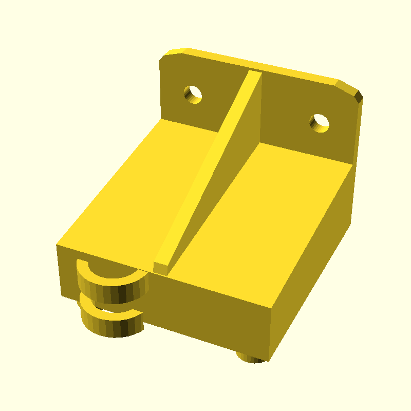

модель платы корпуса драйверов показанная на рисунке. 

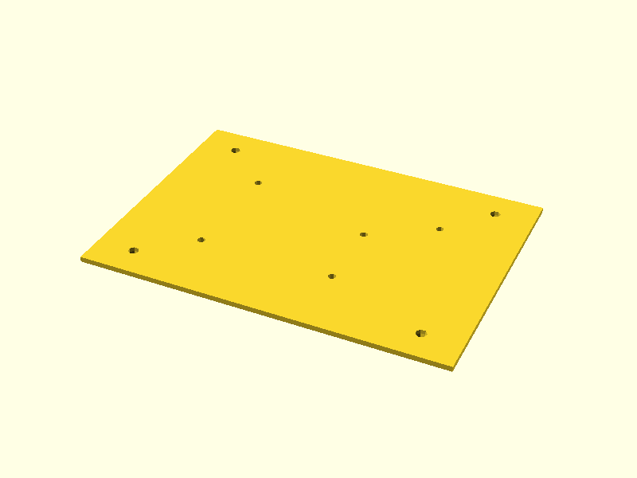

Подготовлена модель крышки корпуса драйверов показанная на рисунке. 

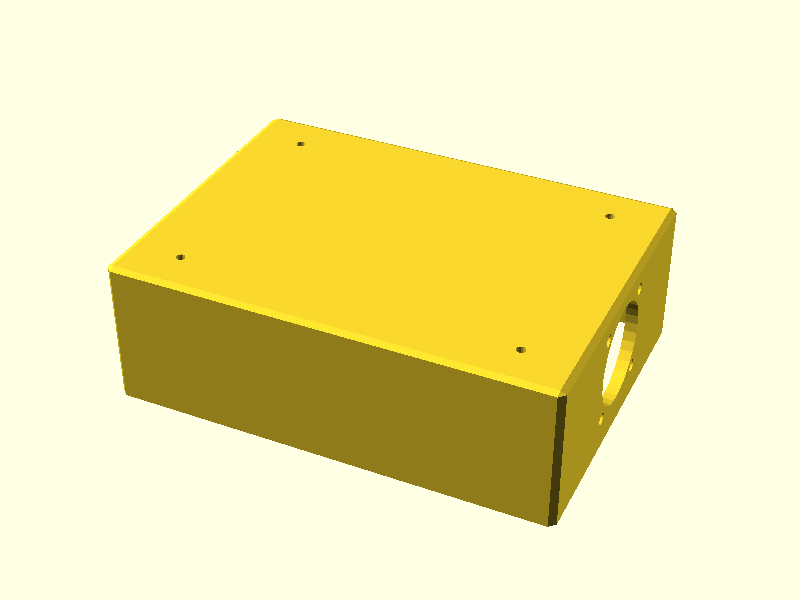

Подготовлена модель концевого упора x показанная на рисунке. 

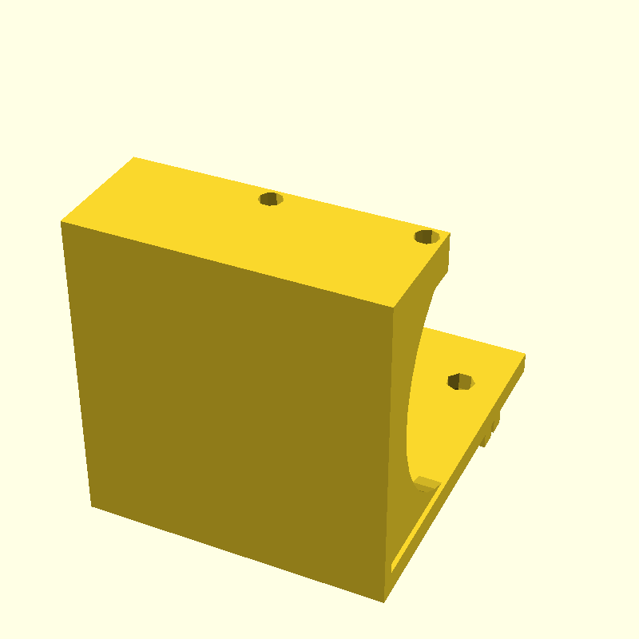

модель концевого упора y показанная на рисунке. 

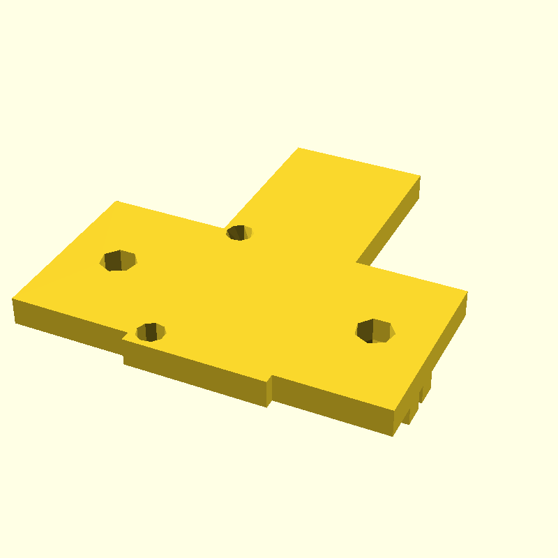

Была создана модель концевого упора z показанная на рисунке. 

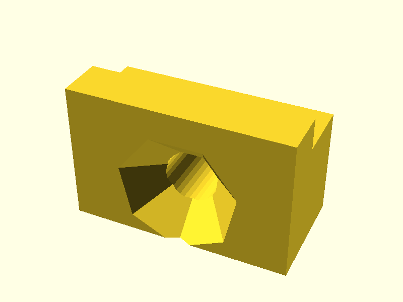

Была разработана модель держателя лазерного датчика показанная на рисунке. 

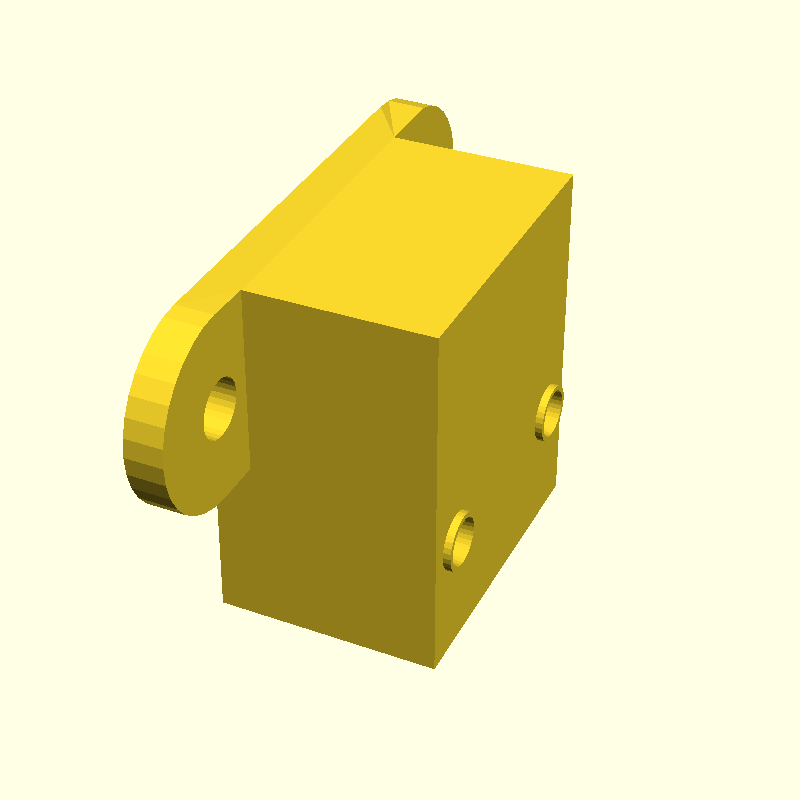

При помощи среды моделирования Blender подготовлена модель заднего левого правого разъема основного корпуса показанная на рисунке. 

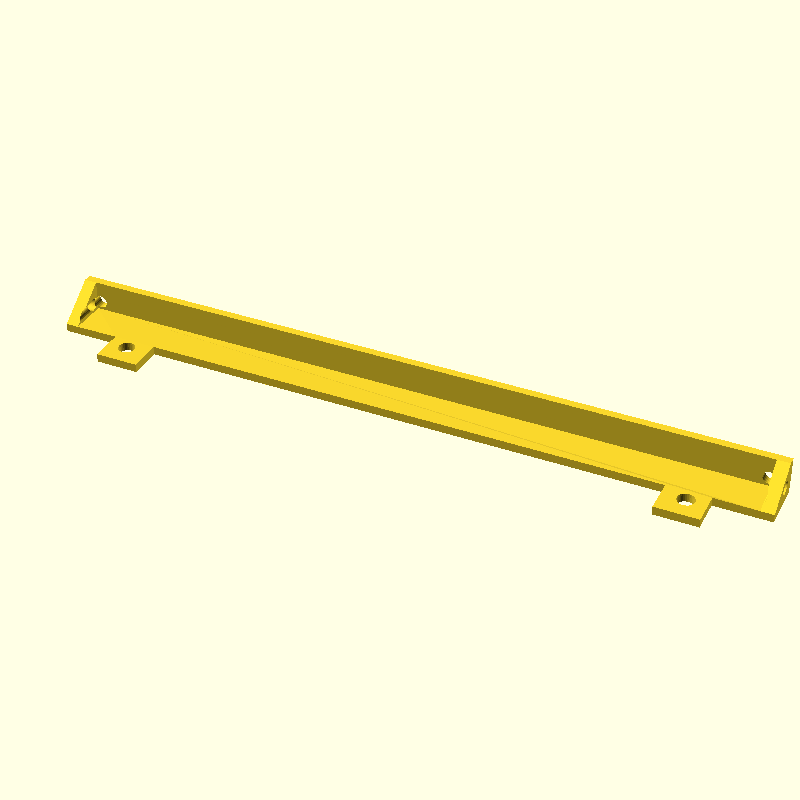

модель задней части основного корпуса показанная на рисунке. 

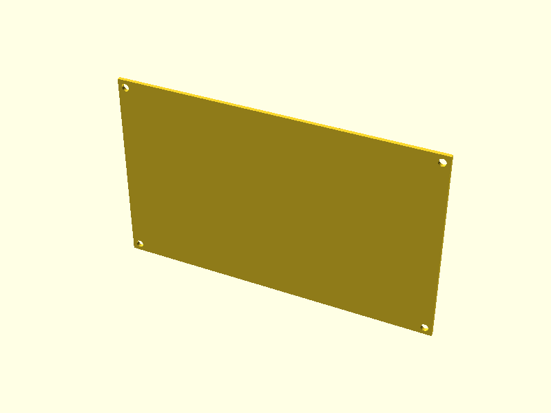

При помощи среды моделирования Blender подготовлена модель левыого и правого разъемов крышки основного корпуса  показанная на рисунке. 

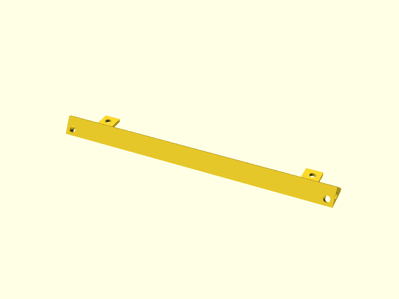

Была разработана модель крышки основного корпуса показанная на рисунке. 

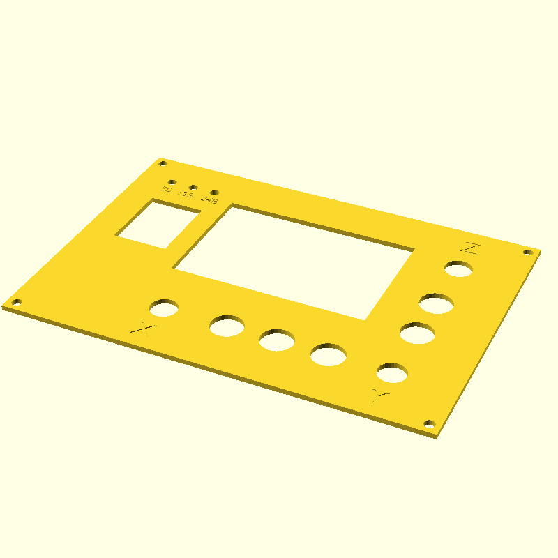

Была разработана модель левой части основного корпуса  показанная на рисунке. 

При помощи среды моделирования Blender подготовлена модель основного корпуса, подставки для raspberry pi  показанная на рисунке. 

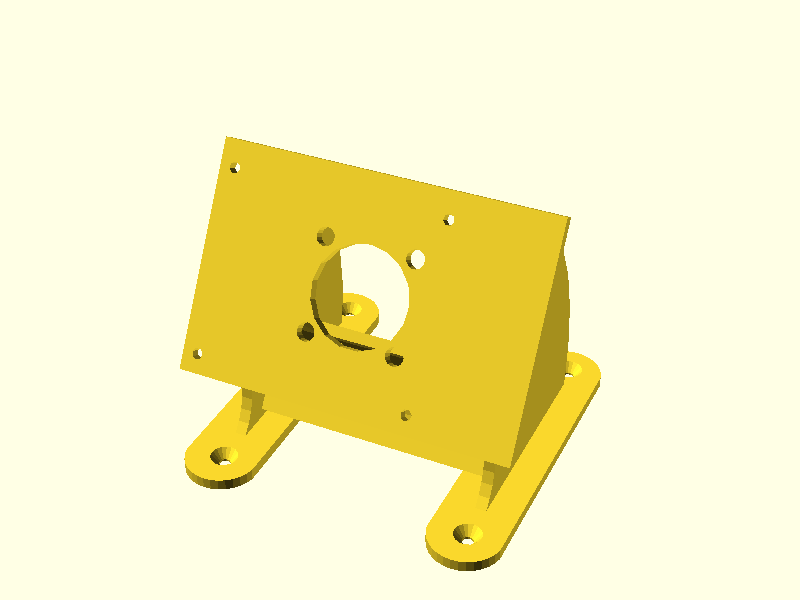

Была создана модель правой части основного корпуса  показанная на рисунке. 

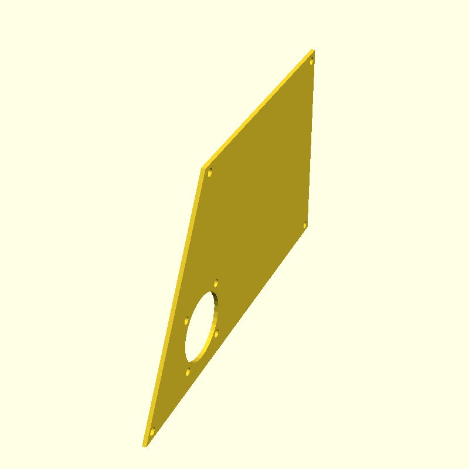

модель верхней части главного корпуса показанная на рисунке. 

Подготовлена модель верхней части корпуса показанная на рисунке. 

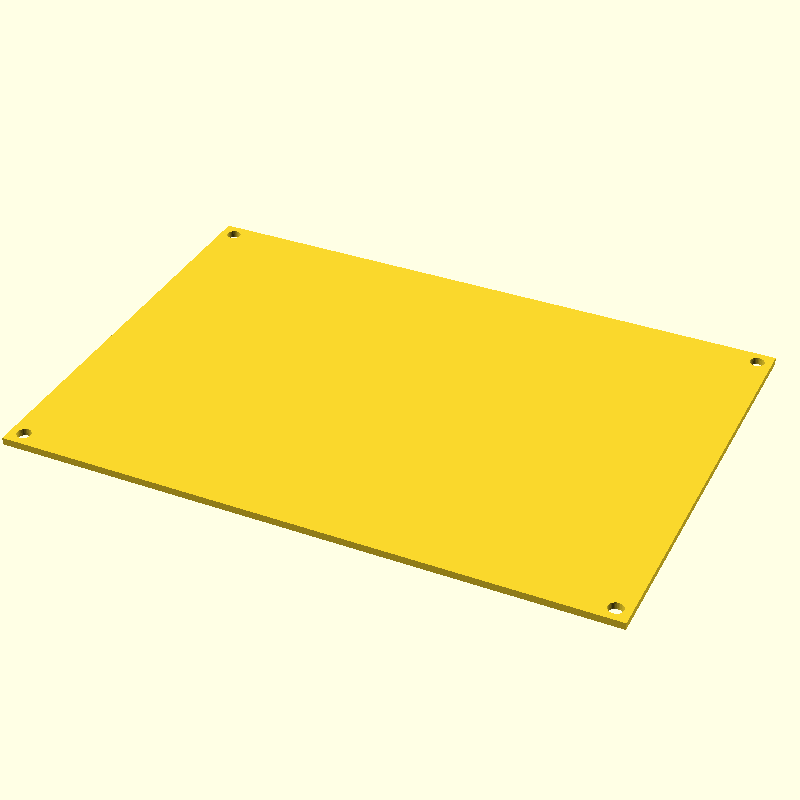

Разработана модель верхнего левого правого угла основного корпуса показанная на рисунке. 

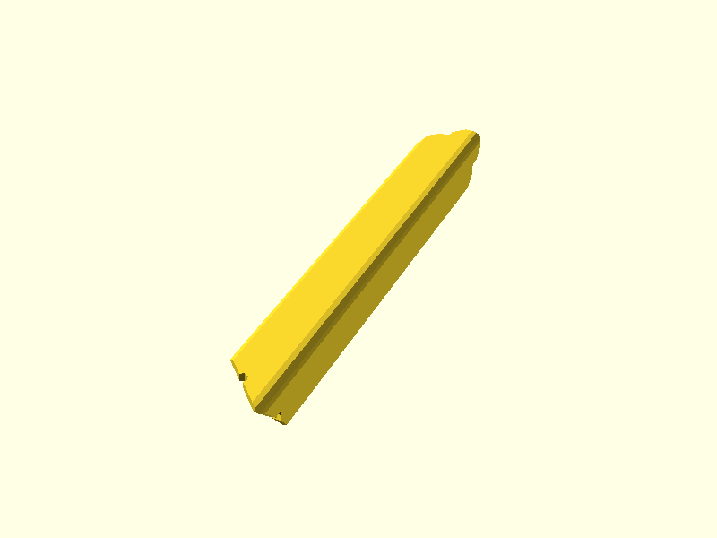

При помощи среды моделирования Blender подготовлена модель держателя блока питания показанная на рисунке. 

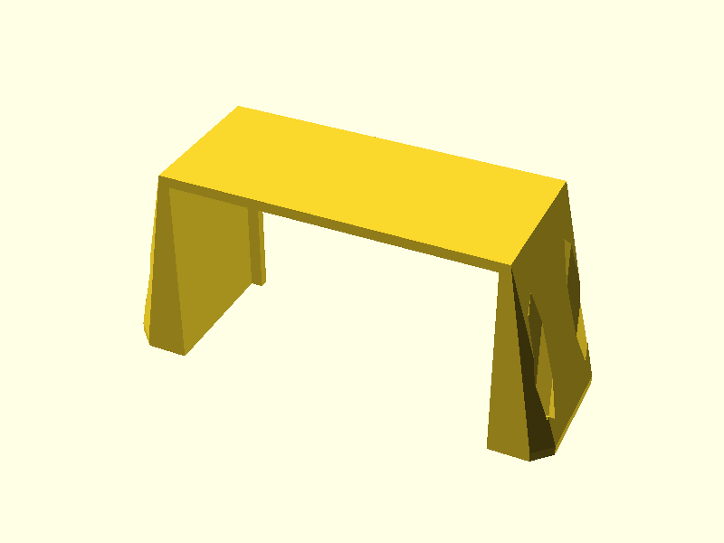

Была создана модель дистанцонной шайбы показанная на рисунке. 

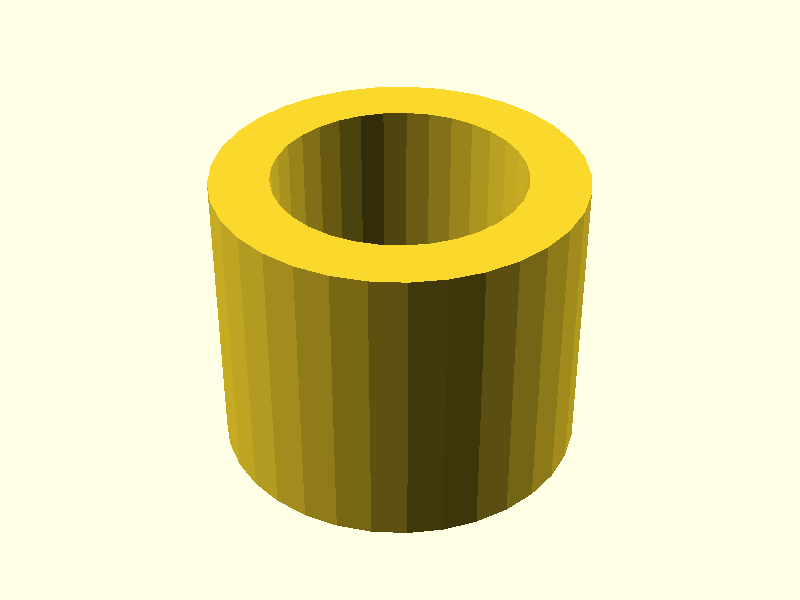

Все модели были подготовлены к печати программным комплексом cura [] и смонтированы на столе. 
Внешний вид полученного устройства показан на рис.

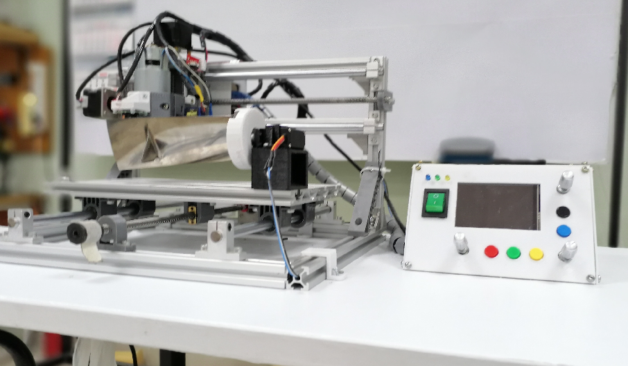
